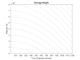
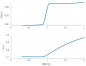
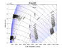
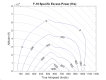
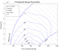

# F-16 Specific Excess Power 

The purpose of this project is to create a Ps diagram of the F-16. You will need to have the Curve Fitting and Optimization toolboxes installed. 

## Objectives

Mature skills using a programming language (MATLAB) to solve engineering problems. Develop a standard atmosphere calculator function for future use as an aeronautical engineer. 

## Documentation

For this project, you may work with anyone, including your instructor and classmates. 
**You MAY use generative artificial intelligence (Gen AI).** 

## Overview

This project will require: 

1) A driver script that contains aircraft data, calculates the energy height and Ps through all needed altitudes and airspeeds, and plots the results 
2) A standalone function that calculates drag and Ps using inputs from the driver 
3) Your atmos206 function  
4) A separate m-file to create the drag curve fits used in the standalone function  

 

# Part 1: Create an energy height contour plot

(Ref Brandt, 5.14) 

Start any large coding project by writing out the major sections required (using `%%` in MATLAB to define a section). This is just like creating an outline for a paper. The sections for this project are: 

1) Define constants (altitude, airspeed ranges) 
2) Input/load aircraft data 
3) Calculate plot data 
4) Make plots 

Once you have the four major sections of the code, add comments within each one identifying what you will be doing in that block based on the instructions below, then add code for the calculations. As you add code, ensure each block is providing the expected outputs before moving on to the next block. 

Energy height can be calculated as the total kinetic and potential energy by: 

$$
H_e = \frac{PE + KE}{W} = \frac{mgh + V^2 m / 2}{W} = h + \frac{V^2}{2g}
$$

Create a script to do the following: 

1) numSteps variable for how many altitude and velocity steps. Start with 10 until your code is working correctly to save time. Once everything is working, set to 1000 (could take 5 minutes to run) 
2) Altitude array that goes from 0 to 80,000 ft in the specified steps 
3) Velocity array that goes from 1 to 1200 knots in the specified steps. 

- Remember that knots is not a standard unit in calculations! 

4) A **for** loop that goes from the first altitude to the last altitude 
5) A **for** loop inside of the previous loop that goes from the first velocity to the last velocity 
6) A calculation that finds the energy height at the corresponding height and velocity. Note that you are now making a 2-D array of data. To save the energy height in the array, the syntax is 
   `energyheight(ii,jj) = (your equation here)`
   where the `ii` is the counter of the outer for loop and `jj` is the counter from the inner loop 
7) Create a contour plot of your energy height data using the contour command. 

- Review the documentation for the contour command as needed 

8) Once the contour plot is working, plot only energy height contours from 0 to 140,000 ft in increments of 10,000 ft levels using the “levels” input to the contour command. Be sure the contours match the y-ticks on the vertical axis. 
9) Because this will be the background of a different graph, set the line color to 70% gray by adding an input to the `contour()` command: `’color’,0.7*[1,1,1]`

- The `[1,1,1]` is a Red-Green-Blue triplet that defines a color. `[0,0,0]` is black and `[1,1,1]` is white. 

The result should look something like Figure 1 below. Make sure you have the lowest contour crossing just under 500 kts at an altitude of zero. 

# Part 2: Use curve fitting in MATLAB to find the drag 

Create a function that returns drag when given altitude and velocity, but this will require some preparation of information (not in your function or script). To find drag, the drag coefficient is needed where $C_D = C_{D0} +k C_L^2$ .  Unfortunately, $C_{D0}$ and $𝑘$ are dependent on Mach number. An F-16 will be used for the example as in Chapter 4 of *Introduction to Aeronautics: A Design Perspective* by Dr. Brandt. 

Table 1: F-16 Drag Polar 

| Mach | $C_{D0}$ | $k$   |
| ---- | -------- | ----- |
| 0.3  | 0.0193   | 0.117 |
| 0.86 | 0.0202   | 0.115 |
| 1.05 | 0.0444   | 0.160 |
| 1.5  | 0.0448   | 0.280 |
| 2.0  | 0.0458   | 0.370 |

 

1) Use the curve fitting toolbox in Matlab to create a fit object that provides interpolated data in the entire Mach range. 

- Create a new m-file for the purpose of preparing the curve-fitted drag data 

- To use the cftool in Matlab, the data in Table 1 needs to be imported in a usable way: 

  - `CD0 = [#1 #2 #3…]`
  - Ensure complete for M, CD0 and k variables by checking them after entry 

  - This data entry can be done many ways, but writing a script will allow for quick fixes 

- Now run the command `cftool` to open the curve fitting interface. 

  - Set the x-data as Mach and the y-data as $C_{D0}$. You should get a graph of the drag in the window that looks like a transonic drag rise. 

  - Explore the matching options in the top center and select the best fit. I found the Interpolant section had some good options based on the shape of the data. 

  - Then “Fit” menu → “Save to workspace” and name your curve something useful. 

- Repeat to create a fit object for k vs Mach 

- To confirm the fit, plot a tiled plot like Figure 2 below. 

- X-data: create an array of new Mach numbers from 0.3 to 2 in increments of 0.01

- Y-data: use your saved curve fit like this: 
  `CD0_vs_Mach(inputMachNumbers)`

   

Figure 2: Curve fits for F-16 drag polar constants 

- Save both of your curve fits in one .mat file for future use by using the save command: 

  - save('F16_drag_data.mat','CD0_vs_Mach','k_vs_Mach') 

- Now clear and load the file to ensure the cfit objects appear in the workspace: 

  - load('F16_drag_data.mat') 

2) Now update your driver program from Part 1: 

- Load your F-16_drag_data.mat file 

- Assume 𝑆= 300𝑓𝑡", 𝑇&% = 23,000      𝑙𝑏, a weight of 21,737  𝑙𝑏, and SLUF where L=W 

- Call your `atmos206()` at the appropriate place to get standard atmosphere properties at each altitude for use in calculating the drag of your aircraft 

3) Create a standalone drag calculation function 

- It should have inputs of density, speed of sound, velocity, S, weight, $C_{D0}$ fit, and 𝑘 fit. 

- It should return a single value for drag that corresponds to these inputs. 

- Remember that $𝐷 = 𝐶_D 𝑞 S$ where $𝑞 = \frac{1}{2} ρ 𝑉^2$, $C_D = C_{D0} + 𝑘 C_L^2$ and $L = C_L q S$ 

- Use your curve fits like a function to find 𝐶#$ and 𝑘, for example: `k=k_vs_mach(calculated_mach_number)`

4) In your main script, calculate drag for the all altitudes and airspeeds in part 1 
5) Use the `contour()` function again to plot the results on top of your $H_e$ contour (use `hold on`) 

- Read the documentation for the `contour()` function. 

- Set the levels to start at 3000 lb, increment by 1000 lb up to 20,000 lb. 

- Set the color to blue using the ‘b’ modifier at the end of the contour call. 

- Add level markers by: 

  - `[M,c] = contour(…);`
  - `clabel(M,c)`
- Use `box on` to turn on borders around the plot. 

- Compare your output to mine below. 

 

Figure 3: F-16 Drag 

# Part 3: Calculate specific excess power 

1) Change your drag calculation function to calculate Ps (save it as a new file with a new name) 

- Calculate thrust available $𝑇_A = 𝑇_{SL}\frac{ρ}{ρ_{SL}} (1 + 0.7   𝑀_∞)$

- Calculate $P_S = \frac{P_x}{W} = \frac{T_x V}{W} = \frac{(T_A - D)V}{W}$  

2) Replace drag contours with Ps contours ranging from zero to max Ps in increments of 200 ft/s 
2) Add a title to the graph to indicate what the contours are (including units) 

 

Figure 4: F-16 specific excess power 

# Part 4: Streamlining code and removing non-physical regions 

1) Ensure unnecessary operations aren’t being done for each iteration of the double loop.

- For example, don’t load the drag data (.mat file) inside the for loops 

2) Pre-allocate 2-D arrays using zeros so the size doesn’t have to change as the for loop executes 

- For example: `He = zeros(length(alts),length(vels))` 

- Repeat for other 2D arrays in the for loops 

3) Only call your atmos206 function when the altitude changes, not on every velocity change 
4) Remove non-physical regions from the graph altering your Ps calculation 

- Aircraft cannot fly below their stall speed, so clip the Ps curve at the stall limit. 

  - Assume $C_{L\ max}$ for the F-16 is about 1.5 

  - If $C_L$ exceeds $C_{L\ max}$, set $P_S=∞$ 

- Aircraft have dynamic pressure limitations as well 

  - The F-16 is limited to about 2173 $\frac{lb}{ft^2}$ dynamic pressure 
  - When $q$ is calculated, if it exceeds $𝑞_{max}$, set $P_S = ∞$. 

5) Tweak the plot 

- Add an annotation box with the aircraft data (see my sample code and plot below) 

- Add text to denote max lift and q limit (see my sample code and plot below) 

- Manually set label locations by using clabel(M,c,'manual') 

- Having trouble? Read the documentation for `clabel()`

6) Check your resulting Ps graph against Figure 5 (or Brandt Fig 5.42): 

 

Figure 5: F-16 specific excess power contour with limits 

# Optional Part 5: Load factor comparison 

1) Create Ps graph for n=3 g’s. 
2) Plot both the 1g and 3g Ps curves as different colors to show the difference. 

# Optional Part 6: Aircraft comparison 

1) Use the data for your AE210 aircraft from JET10 to recreate the Ps plot. 
2) Replace S, CLmax, qmax, CDO, k, and TSL with data for your aircraft and plot the Ps graph. 
3) Save the Ps data for both your aircraft and the F-16 
4) Subtract the F-16 performance from your aircraft 

# Part 7: Draft a technical report

1. As part of your MATLAB script comment header, write a documentation statement. As a block comment, write a paragraph describing the problem, and another block comment paragraph after your code briefly explain the solution shown in the graph. Use the “Publish” button in MATLAB to export a PDF and append to the technical report. 
2. Use the Project 3 AIAA Report Template to draft your technical report. 
3. Replace the yellow highlighted sections with your abstract, results, discussion, and conclusion. 
4. Include an abstract based on the guidance in the template. 
5. Include your Ps graph for the F-16 from Part 4, and the optional ones from Part 5 and 6 if completed, (vector graphic figure, NO SCREENSHOTS) with a descriptive caption. 
6. Include a discussion about your results and the utility of the data. 

- Explain how the graph was created, and what it shows about the aircraft performance 

- Explain what energy height contour lines show 

- Explain what Ps contour lines show 

- Explain how to minimize time to climb 

# Assignment Submission 

Submit to your github repository:

- report pdf
- results spreadsheet
- matlab script(s)