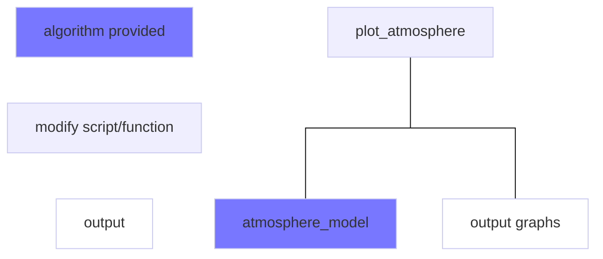

# atmosphere model 
Create and validate a matlab function to calculate atmospheric properties from the 1976 Standard Atmosphere model. A Standard Atmosphere calculator is a powerful tool that you will use throughout your cadet, engineering, flying, and flight test careers.


## Objectives

Develop proficiency using a programming language (MATLAB) to solve an engineering problem. Develop a standard atmosphere calculator function for future use as an aeronautical engineer. 


## Documentation

For this project, you may work with anyone, including your instructor and classmates. 


## Overview

Your calculator should: 

1) Be a standalone function that receives an altitude and returns the Temperature, Pressure, Density, and Speed of Sound for the corresponding altitude. 
2) Work for altitudes between sea level and the top of the Mesopause (91 km, 298556 ft) and gives an informative error message if used incorrectly. 
3) (Aero majors only) Receive a second string input that specifies a unit system (‘SI’ or ‘EE’). 


## function
Modify the standalone matlab function [atmosphere_model.m](atmosphere_model.m) by following the algorithm provided in [atmosphere_model_algorithm.md](atmosphere_model_algorithm.md). 

A standalone function means it is a .m file that begins with the keyword `function` (and
ends with the keyword `end`). With this syntax you can call your function from another .m script or from the command line as long as the function file is in matlab's current folder/directory. 

Test your function by calling it with various inputs. 
``` matlab
atmosphere_model(2006)
```

Also test your error handling by providing values out of range. 
``` matlab
atmosphere_model(-5)
atmosphere_model(1e6)
```

Compare your outputs to a reference such as [https://www.engineeringtoolbox.com/standard-atmosphere-d_604.html](https://www.engineeringtoolbox.com/standard-atmosphere-d_604.html)
(remember to describe any sources you use in your USAFA documentation statement)
## test script
Create a test script [test_script_atmosphere.m](test_script_atmosphere.m) that evaluates atmospheric parameters at several altitudes (at least 4) throughout the expected range. Include the outputs in your validation report. 

Also, you must test all possible paths through your code. Make sure you test each condition for any reachable if statement. In other words, you should test both errors (too low/too high) as well as both regions (linear/isothermal). In addition, test any unique or interesting edge cases (such as 0 alt). 

## validation report
Create a validation report [test_atmosphere.md](test_report_atmosphere.md) to document your function's correct output. 

- [ ] modified/completed atmosphere function (atmosphere_model.m)
- [ ] validation test script (test_script_atmosphere.m)
- [ ] validation test documentation (test_report_atmosphere.md)

# AM2 atmosphere model report
(\~30–60 min)

(\~60–90 min)
Write a medium-length report [atmosphere_report.md](atmosphere_report.md) describing your atmosphere model. 

Modify the driver script  [plot_atmosphere.m](plot_atmosphere.m) to plot atmosphere model outputs throughout the model's valid altitude range. Compare your atmosphere model to [`atmosisa()`](https://www.mathworks.com/help/aerotbx/ug/atmosisa.html), an atmosphere model provided with matlab's aerospace toolbox. 

Plot results using Engr 495 plotting standards. Save figure as an SVG file. Output should look like the sample below, although newer versions of matlab will show better agreement between the student model and the matlab model. 


### submission
- [ ] completed/modified driver script (plot_atmosphere.m)
- [ ] output plot image (svg file)
- [ ] completed report (atmosphere_report.md)

# project directions

## overview
The purpose of this project is to write a standard atmosphere calculator function using the 1976 Standard Atmosphere Model data given below. A Standard Atmosphere calculator is a powerful tool that you will use throughout your cadet, engineering, flying, and flight test careers. Your calculator should:
1) Be a standalone function that receives an altitude and returns the Temperature, Pressure, Density, and Speed of Sound for the corresponding altitude.
2) Work for altitudes between sea level and the top of the Mesopause (91 km, 298556 ft).
3) Give an informative error message if used incorrectly.




## authorized resources
For this project, you may work with anyone, including your instructor(s) and
classmates. You may *not* use generative artificial intelligence (Gen AI).

## objectives
- Develop proficiency using a programming language (MATLAB) to solve an engineering problem. 
- Develop a standard atmosphere calculator function for future use as an  engineer.
- Validate an algorithm implementation using test points and/or unit tests