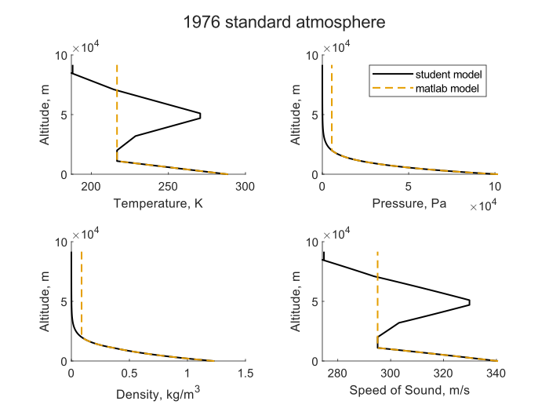

# atmosphere model 
Create and validate a matlab function to calculate atmospheric properties from the 1976 Standard Atmosphere model. A Standard Atmosphere calculator is a powerful tool that you will use throughout your cadet, engineering, flying, and flight test careers.


## Objectives

Develop proficiency using a programming language (MATLAB) to solve an engineering problem. Develop a standard atmosphere calculator function for future use as an aeronautical engineer. 


## Documentation

For this project, you may work with anyone, including your instructor and classmates. 


## Overview

Your calculator should: 

1) Be a standalone function that receives an altitude and returns the Temperature, Pressure, Density, and Speed of Sound for the corresponding altitude. 
2) Work for altitudes between sea level and the top of the Mesopause (91 km, 298556 ft). 
3) Provide an informative error message if used incorrectly. 
4) **(Aero majors only)** This will be part of the Aero/Astro block later in the semester: Accept a second string input argument specifying a unit system (‘SI’ or ‘EE’). 


# Part 1: standalone function: atmosphere_model()
Modify the standalone matlab function [atmosphere_model.m](atmosphere_model.m) by following the algorithm provided in [atmosphere_model_algorithm.md](atmosphere_model_algorithm.md). 

A standalone function means it is a .m file that begins with the keyword `function` (and optionally ends with the keyword `end`). With this syntax you can call your function from another .m script or from the command line. 


# Part 2: function test/validation

First, informally test your function by calling it from the command window with various inputs. 

``` matlab
[T, a, P, rho] = atmosphere_model(2006)
```

Also test your error handling by providing values out of range. 
``` matlab
[T, a, P, rho] = atmosphere_model(-5)
```


Next, prepare and execute a thorough function validation test. Document your results in a function validation report. 

- *test_script_atmosphere.m*: list all your chosen test values
  - your test cases must cover every possible path through your code
    - for example, both possibilities of every `if` statement
    - at least 2 linear cases and 2 isothermal cases
  - you may have to comment out the erroneous input values after running them; make a comment in the test script about the failure
- *validation_report.md*: list your test case inputs/outputs. Compare to expected values—hand calculations or an external reference; provide thorough academic and USAFA documentation for any external references. 
  - For example, don't just provide a link to a website calculator. Tell me what inputs you used
  - If desired, you can compare your outputs to a reference like this one: [https://www.engineeringtoolbox.com/standard-atmosphere-d_604.html](https://www.engineeringtoolbox.com/standard-atmosphere-d_604.html)


# Part 3: atmosphere model plotting
Modify the driver script [plot_atmosphere.m](plot_atmosphere.m) to plot your model's outputs throughout the model's valid altitude range. Compare your atmosphere model to matlab's [`atmosisa()`](https://www.mathworks.com/help/aerotbx/ug/atmosisa.html), provided with the aerospace toolbox. 

Plot results using Engr 201 plotting standards. Save figure as an SVG file. Output should be identical to the example below. 




# Part 4: Submission report

Write a medium-length report [atmosphere_report](atmosphere_report.md) describing your atmosphere model. 


## Submission

Commit and push all files to your remote (github) repository. Verify that everything shows up correctly on github.com

When complete, create a pull request and request a review from your instructor. 


- [ ] modified/completed atmosphere function (atmosphere_model.m)
- [ ] validation test script (test_script_atmosphere.m)
- [ ] validation test documentation (validation_report.md)
- [ ] completed/modified driver script (plot_atmosphere.m)
- [ ] output plot image (svg file)
- [ ] completed report (atmosphere_report.md)


